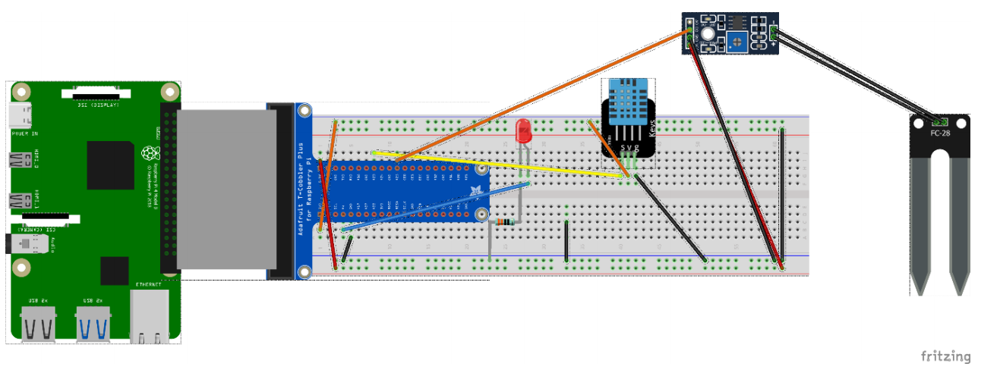

<h1> Greenhouse Temperature System</h1>

This Repo contains the source code and project files for a project I did at the Southern Institute of Technology.

<h4>This system uses a:</h4>
<ul>
 <li>Raspberry Pi 4B</li>
 <li>DHT11 Humidity/Moisture Sensor</li>
 <li>Soil Moisture Sensor</li>
 <li>Raspberry Pi Camera</li>
 <Li>3 LEDs</li>
</ul>

The Greenhouse Temperature System uses a MySQL and a Flask Web Server to store the data collected, and then it uses the webserver to display this information on a small website.

Included in this Repo is the Source Files, which are the Python 3 and HTML Codes used for this application.

<h3>With the System there are 4 different scripts</h3>

The first script (app.py) is the Flask Web Server python script which retrieves and displays information from the MySQL Database on a Website.

The second script (led.py) is a small Python script which blinks an LED connected to the pi, which is run when the user visits the flicker URL on the website. This allows 2-way communication from the user and the server, with the information being retrieved from the MySQL database, while the user can turn the led's on for a brief couple of seconds.

The third script (project.py) is the script which collects and records the data from the sensors and inserts this into the MySQL Database.

The fourth and final script (tempsystem.sh) is a small Bash Script, allowing the python scripts to be launched automatically by running this script. This is used on the Raspberry Pi to allow the user to automatically launch the scripts on startup.

 A Demo video of my Greenhouse Temp System in action can be viewed at: <a href="https://youtu.be/HdIvgRtLvS0" target="_blank">https://youtu.be/HdIvgRtLvS0</a>

